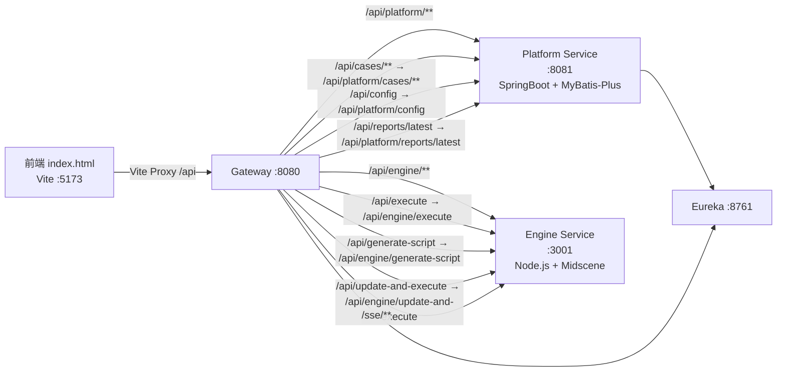

## 产品概述

将智能测试中台从原有的 Node.js Express 后端平滑切换到 Java 微服务后端（SpringCloud Gateway + Platform Service + Engine Service），确保前端无需修改即可正常运行所有功能。

## 核心目标

1. **API 路径兼容**：前端调用的旧路径（`/api/cases`、`/api/config`、`/api/execute` 等）能正确路由到 Java 微服务对应接口
2. **补齐缺失端点**：Java/Engine 服务中缺失的 `generate-script`、`update-and-execute`、`reports/latest` 等接口
3. **保持功能一致**：项目管理、用例管理、AI配置、脚本生成、测试执行、报告查看全部可用
4. **启动流程就绪**：更新启动脚本，确保本地开发可一键启动所有微服务

## 差异分析

### 前端调用路径 vs 后端实际路径

| 前端调用 | Java/Engine 实际路径 | 问题 |
| --- | --- | --- |
| `GET/POST /api/cases` | `GET/POST /api/platform/cases` | 路径前缀不匹配 |
| `GET/PUT/DELETE /api/cases/:id` | `GET/PUT/DELETE /api/platform/cases/{id}` | 路径前缀不匹配 |
| `GET /api/config` | `GET /api/platform/config` | 路径前缀不匹配 |
| `POST /api/config` | `PUT /api/platform/config` | 路径前缀+HTTP方法不匹配 |
| `POST /api/generate-script` | 不存在 | 端点缺失 |
| `POST /api/execute` | `POST /api/engine/execute` | 路径前缀不匹配 |
| `POST /api/update-and-execute` | 不存在 | 端点缺失 |
| `GET /api/reports/latest` | 不存在 | 端点缺失 |

## 技术方案

### 核心策略：Gateway 适配层 + 端点补齐

不在前端做任何修改，通过 Spring Cloud Gateway 的 `RewritePath` 过滤器将前端旧路径映射到后端新路径，同时在 Platform Service 和 Engine Service 中补齐缺失的 API 端点。

### 架构设计

### 修改文件清单

| 文件 | 操作 | 说明 |
| --- | --- | --- |
| `backend/gateway-service/src/main/resources/application.yml` | MODIFY | 新增 5 条兼容路由规则 |
| `backend/platform-service/.../controller/AiConfigController.java` | MODIFY | 新增 POST /config 端点 |
| `backend/platform-service/.../controller/ReportController.java` | MODIFY | 新增 GET /reports/latest 端点 |
| `engine-service/src/index.js` | MODIFY | 新增 generate-script 和 update-and-execute 端点 |
| `engine-service/package.json` | MODIFY | 添加 axios 依赖用于回调通知 |

### Gateway RewritePath 路由设计

所有兼容路由使用 `RewritePath` 过滤器将旧路径重写为新路径后转发到对应服务。关键设计：

1. `/api/cases(?<segment>.*)` → `/api/platform/cases${segment}` — 覆盖所有 cases CRUD 操作
2. `/api/config` → `/api/platform/config` — GET 和 POST 统一处理
3. `/api/execute` → `/api/engine/execute` — 执行任务转发
4. `/api/generate-script` → `/api/engine/generate-script` — 脚本生成转发
5. `/api/update-and-execute` → `/api/engine/update-and-execute` — 更新并执行转发
6. `/api/reports/latest` → `/api/platform/reports/latest` — 最新报告转发

**约束**：兼容路由需放置在原有路由之前，确保优先匹配。

## 使用的 Agent 扩展

### SubAgent

- **code-explorer**
- 用途：在修改前探索 gateway 配置、Java Controller、Engine Service 等关键文件的结构
- 预期结果：获取精确的文件路径、现有路由定义、API 签名，确保方案准确可执行