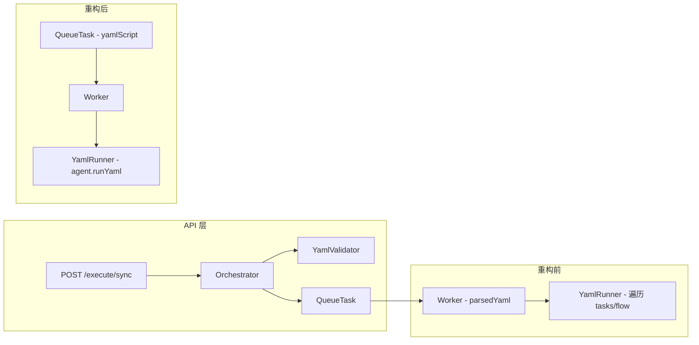

## Product Overview

重构 execute-service 的 YAML 执行引擎，用 Midscene 原生 `agent.runYaml()` 替代手动解析 YAML 并逐步调用 agent API（ai/aiAssert/aiQuery 等）的方式，大幅简化核心代码。

## Core Features

- **升级 Midscene SDK**: 将 `@midscene/web` 从 0.30.10 升级到最新版本，确保 `runYaml` API 可用
- **重写 YamlRunner**: 移除手动 YAML 解析和逐步执行逻辑（executeStep/runTask/describeStep 等方法），改为调用 `agent.runYaml(tasksYaml)`
- **Agent 初始化增强**: 从 YAML 的 `agent` 配置段提取 `generateReport`、`reportFileName`、`aiActContext`、`cache`、`replanningCycleLimit` 等配置用于 Agent 构造函数
- **AI 模型配置**: 使用 `overrideAIConfig()` 支持从环境变量编程式设置 AI 模型参数（baseUrl/apiKey/model），确保 runYaml 执行时模型配置已就绪
- **Web 配置保留**: 从 YAML 的 `web` 配置段提取浏览器相关配置（url、viewport、cookie、waitForNetworkIdle 等）用于浏览器初始化和页面导航
- **简化 YamlValidator**: 仅保留 YAML 语法和基本结构校验（必须有 tasks 段），移除复杂的步骤类型解析（ParsedTask/FlowStep）
- **简化数据模型**: QueueTask 改为存储原始 yamlScript 字符串；ExecutionRecord.parsedYaml 类型调整为 any
- **API 接口不变**: /execute/sync、/execute/async、/execute/:id/status 等接口签名完全不变，前端无需修改

## Tech Stack

- TypeScript + Fastify（现有）
- `@midscene/web`（升级到最新版本以获得 `runYaml` API）
- `overrideAIConfig` - 从 `@midscene/web/playwright` 导出，用于编程式 AI 模型配置
- Playwright - 浏览器自动化（保留，用于 browser/context/page 初始化）
- `js-yaml` - YAML 解析（仅用于提取 web/agent 配置段，不用于步骤解析）
- `yaml.dump()` - 将 tasks 段序列化为 YAML 字符串传给 runYaml

## Implementation Approach

### 核心重构策略

**当前流程**（手动执行，约 480 行代码）:

```
yamlScript → YamlValidator.validate() → ParsedYaml{target,tasks}
  → YamlRunner.run()
    → chromium.launch() → browser.newContext() → context.newPage()
    → new PlaywrightAgent(page)
    → page.goto(url)
    → for each task → for each step → switch(step.type)
      → agent.aiAction / agent.aiAssert / agent.aiQuery / page.waitForTimeout
```

**重构后流程**（runYaml 执行，约 120 行代码）:

```
yamlScript → YamlValidator.validate()（简化版）
  → YamlRunner.run(yamlScript)
    → yaml.load() → 提取 web/agent/tasks 三段
    → overrideAIConfig(modelConfig)  // AI 模型配置
    → chromium.launch() → browser.newContext(webOpts) → context.newPage()
    → loadCookies()（如有）
    → new PlaywrightAgent(page, agentOpts)
    → page.goto(url)
    → agent.runYaml(yaml.dump({tasks}))  // Midscene 原生执行
```

### 关键技术决策

1. **`runYaml()` 只解析 tasks 段**: 根据 Midscene 官方文档，`agent.runYaml()` 只会解析和执行 `tasks` 字段。`web` 和 `agent` 配置需要在 JS 代码中处理后再调用 runYaml。

2. **AI 模型配置通过 overrideAIConfig**: `agent` 段不支持 AI 模型参数（baseUrl/apiKey/modelName）。使用 `overrideAIConfig({ baseUrl, apiKey, model })` 在 Agent 初始化前设置，环境变量 `MIDSCENE_MODEL_BASE_URL/API_KEY/NAME` 作为默认值。

3. **升级 @midscene/web**: 当前安装的 `@midscene/web@0.30.10` 在 dist 中**不存在 `runYaml` 方法**（已在 pnpm store 中全局搜索确认）。`engine-service` 使用 `@midscene/web@^0.28.0` 有 `runYaml`，但 0.30.10 被移除或重定位。需要升级到最新版本（可能是 0.31+）或从 `@midscene/web/yaml` 导入独立的 `runYaml` 函数。执行时将首先尝试 `pnpm update @midscene/web@latest` 并验证 API 可用性。

4. **进度事件降级**: 使用 `runYaml()` 后无法获取细粒度的 step_start/step_complete 事件（每个步骤的 index/type/duration/result）。保留 `onTaskStartTip` 回调获取任务级进度（subTask），以及完成/失败事件。这是简化架构的合理权衡。

5. **QueueTask 改为存原始 YAML**: 队列中存储原始 `yamlScript` 字符串而非解析后的 `ParsedYaml` 对象，减少类型耦合。`ExecutionRecord.parsedYaml` 改为 `any` 类型（存储原始 doc 或 null）。

### Implementation Notes

- **`overrideAIConfig` 已确认可用**: 从 `@midscene/web/dist/es/playwright/index.mjs` 第 4 行和第 21 行确认导出
- **`PlaywrightAgent` 构造选项**: `WebPageAgentOpt = AgentOpt & WebPageOpt`，支持 `waitForNetworkIdleTimeout`、`forceSameTabNavigation`、`beforeInvokeAction`、`afterInvokeAction`、`customActions` 等
- **向后兼容**: API 接口（/execute/sync, /execute/async, /execute/:id/status, /execute/:id/cancel）签名完全不变，前端无需修改
- **配置优先级**: 环境变量 > 默认值；YAML agent 段配置 > Agent 默认值
- **报告路径**: `agent.reportFile` 属性在 runYaml 执行后可用，用于生成报告 URL

## Architecture Design

### 执行流程对比

```mermaid
flowchart TD
    subgraph 重构前 - 手动逐步执行
        A1[yamlScript] --> B1[YamlValidator - 复杂解析]
        B1 --> C1[ParsedYaml + ParsedTask + FlowStep]
        C1 --> D1[YamlRunner.run]
        D1 --> E1[chromium.launch + newContext]
        E1 --> F1[new PlaywrightAgent]
        F1 --> G1[page.goto]
        G1 --> H1[for each task]
        H1 --> I1[for each flow step]
        I1 --> J1{step.type?}
        J1 -->|ai/aiAction| K1[agent.aiAction]
        J1 -->|aiAssert| L1[agent.aiAssert]
        J1 -->|aiQuery| M1[agent.aiQuery]
        J1 -->|sleep| N1[page.waitForTimeout]
        K1 --> O1[构建 StepResult]
        L1 --> O1
        M1 --> O1
        N1 --> O1
        O1 --> P1[emit step_complete]
    end

    subgraph 重构后 - runYaml 原生执行
        A2[yamlScript] --> B2[YamlValidator - 简化校验]
        B2 --> D2[YamlRunner.run]
        D2 --> L2[yaml.load 提取 web/agent/tasks]
        L2 --> M2[overrideAIConfig 模型配置]
        M2 --> E2[chromium.launch + newContext]
        E2 --> F2[new PlaywrightAgent - agent opts]
        F2 --> G2[page.goto]
        G2 --> P2[agent.runYaml - tasks段]
        P2 --> Q2[返回 result]
    end
```



### 数据流变化



## Directory Structure

```
execute-service/src/
├── core/
│   ├── yaml-runner.ts          # [REWRITE] 核心：用 runYaml + overrideAIConfig 替代手动执行
│   ├── yaml-validator.ts       # [SIMPLIFY] 仅 YAML 语法 + tasks 段存在性校验
│   ├── worker.ts               # [MODIFY] 适配 raw yamlScript 传参给 YamlRunner
│   ├── orchestrator.ts         # [MODIFY] 简化验证调用，队列存 yamlScript
│   ├── worker-pool.ts          # [不变]
│   └── cancel-manager.ts       # [不变]
├── models/
│   ├── test-case.ts            # [MODIFY] 移除 ParsedTask/FlowStep，保留 TestCaseInput
│   ├── execution.ts            # [MODIFY] ExecutionRecord.parsedYaml 改为 any
│   └── progress.ts             # [不变]
├── queue/
│   └── interface.ts            # [MODIFY] QueueTask.parsedYaml 改为 yamlScript: string
├── api/                        # [不变]
├── progress/                   # [不变]
├── store/                      # [不变]
├── reports/                    # [不变]
└── utils/                      # [不变]
```