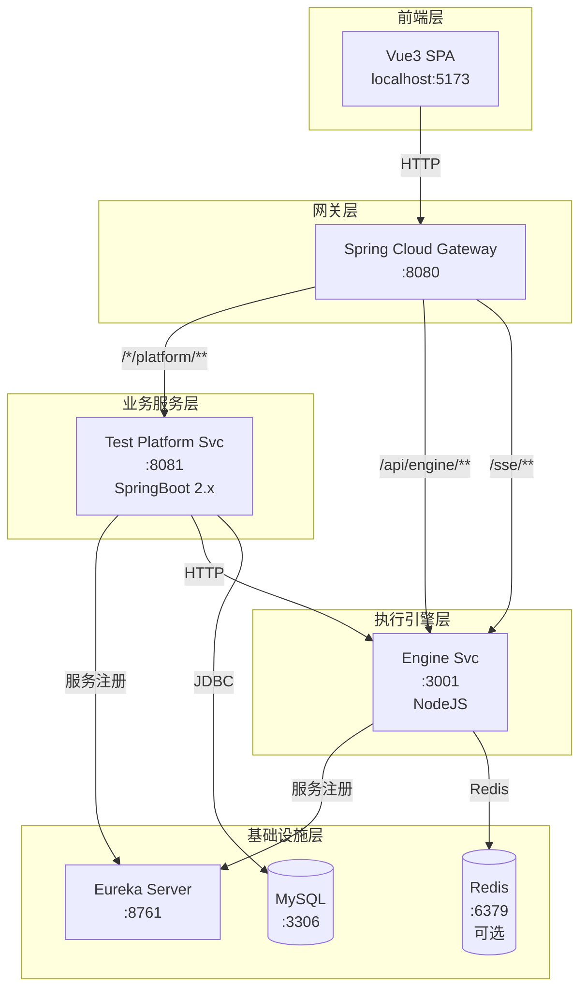

## 产品概述

智能测试中台是一个企业级 AI 驱动的自动化测试平台，基于 Midscene 全流程构建，支持自然语言转脚本、可视化 YAML 编辑、批量用例管理和实时执行监控。

## 核心功能

- **NLP 转脚本**：输入自然语言测试指令，AI 自动生成 Midscene yaml.ts 测试脚本
- **可视化 YAML 编辑**：语法高亮、格式验证、Flow 步骤拖拽编辑
- **测试用例管理**：用例 CRUD、批量删除、状态筛选、项目分组
- **测试执行引擎**：基于 Midscene + Playwright 的自动化 UI 测试执行
- **报告中心**：执行报告查看、历史统计、HTML 原生报告
- **SSE 实时日志**：执行过程实时推送，支持日志折叠显示状态摘要

## 架构变更要求

1. 将 server 目录从 NodeJS (Express) 变更为 SpringCloud 微服务架构
2. 将 Midscene 执行引擎独立为 NodeJS 服务
3. 职责分离：SpringCloud 处理业务逻辑和数据持久化，NodeJS 处理执行引擎

## 技术栈

| 组件 | 技术选型 | 版本 |
| --- | --- | --- |
| 前端 | Vue 3 + Vite | 3.x / 5.x |
| 后端框架 | Spring Boot | 2.7.x |
| JDK | OpenJDK | 11 |
| ORM | MyBatis-Plus | 3.5.x |
| 数据库 | MySQL | 8.0 |
| 服务治理 | Eureka | Hoxton.SR12 |
| 网关 | Spring Cloud Gateway | 3.x |
| 执行引擎 | NodeJS + Express | 18.x / 4.x |
| 自动化框架 | Midscene.js + Playwright | latest / 1.54+ |
| 日志推送 | SSE (Server-Sent Events) | - |
| 部署 | Docker Compose | - |


## 技术架构

### 系统架构图



### Docker Compose 部署架构

| 服务 | 镜像 | 端口 | 说明 |
| --- | --- | --- | --- |
| frontend | nginx:alpine | 80 | 前端静态资源 |
| eureka | eureka-server | 8761 | 服务注册中心 |
| gateway | gateway | 8080 | API 网关 |
| test-platform | test-platform | 8081 | 业务服务 (SpringBoot) |
| engine-svc | engine-svc | 3001 | 执行引擎 (NodeJS) |
| mysql | mysql:8.0 | 3306 | 数据库 |
| redis | redis:alpine | 6379 | 缓存/任务队列 |


## 目录结构

### SpringCloud 项目结构

```
smart-testing-platform/
├── platform-service/                    # [NEW] 业务服务
│   ├── src/main/java/com/testing/
│   │   ├── PlatformApplication.java      # 启动类
│   │   ├── config/                       # 配置类
│   │   ├── controller/                   # REST 控制器
│   │   │   ├── ProjectController.java
│   │   │   ├── TestCaseController.java
│   │   │   ├── ReportController.java
│   │   │   └── ConfigController.java
│   │   ├── service/                      # 业务逻辑
│   │   │   ├── ProjectService.java
│   │   │   ├── TestCaseService.java
│   │   │   ├── ReportService.java
│   │   │   └── EngineClient.java
│   │   ├── mapper/                       # MyBatis Mapper
│   │   ├── entity/                       # 实体类
│   │   ├── dto/                          # 数据传输对象
│   │   └── common/                       # 公共类
│   ├── src/main/resources/
│   │   ├── application.yml
│   │   └── mapper/*.xml
│   └── pom.xml
│
├── gateway-service/                     # [NEW] 网关服务
│   └── pom.xml
│
├── eureka-server/                       # [NEW] 注册中心
│   └── pom.xml
│
└── docker/
    ├── Dockerfile.platform
    ├── Dockerfile.gateway
    └── docker-compose.yml
```

### NodeJS 执行引擎结构

```
engine-service/                           # [NEW] 执行引擎服务
├── src/
│   ├── index.js              # 入口文件
│   ├── config/               # 配置
│   ├── routes/               # API 路由
│   │   ├── execute.js        # 执行 API
│   │   └── health.js         # 健康检查
│   ├── services/
│   │   ├── scriptGenerator.js  # 脚本生成器
│   │   ├── midsceneRunner.js  # Midscene 执行器
│   │   ├── reportGenerator.js  # 报告生成器
│   │   └── taskManager.js      # 任务管理器
│   ├── sse/
│   │   └── sseEmitter.js        # SSE 事件发射器
│   └── utils/
│       ├── yamlParser.js
│       └── logger.js
├── reports/                   # 报告存储
├── scripts/                   # 脚本存储
├── package.json
├── Dockerfile
└── docker-compose.yml
```

## API 接口设计

### Platform 服务 API

| 方法 | 路径 | 说明 |
| --- | --- | --- |
| GET | /api/platform/projects | 获取项目列表 |
| POST | /api/platform/projects | 创建项目 |
| GET | /api/platform/projects/{id} | 获取项目详情 |
| PUT | /api/platform/projects/{id} | 更新项目 |
| DELETE | /api/platform/projects/{id} | 删除项目 |
| GET | /api/platform/cases | 获取用例列表 |
| POST | /api/platform/cases | 创建用例 |
| GET | /api/platform/cases/{id} | 获取用例详情 |
| PUT | /api/platform/cases/{id} | 更新用例 |
| DELETE | /api/platform/cases/{id} | 删除用例 |
| POST | /api/platform/cases/batch-delete | 批量删除 |
| GET | /api/platform/reports | 获取报告列表 |
| GET | /api/platform/reports/{caseId} | 获取用例报告 |
| GET | /api/platform/config | 获取 AI 配置 |
| PUT | /api/platform/config | 保存 AI 配置 |


### Engine 服务 API

| 方法 | 路径 | 说明 |
| --- | --- | --- |
| POST | /api/engine/execute | 提交执行任务 |
| GET | /api/engine/status/{taskId} | 查询任务状态 |
| DELETE | /api/engine/task/{taskId} | 取消任务 |
| GET | /sse/logs/{taskId} | SSE 实时日志流 |
| GET | /api/engine/report/{taskId} | 获取报告 JSON |
| GET | /api/engine/health | 健康检查 |


## 数据模型

### 数据库表设计

```sql
-- 项目表
CREATE TABLE project (
    id BIGINT PRIMARY KEY AUTO_INCREMENT,
    name VARCHAR(100) NOT NULL,
    description VARCHAR(500),
    created_at DATETIME DEFAULT CURRENT_TIMESTAMP,
    updated_at DATETIME DEFAULT CURRENT_TIMESTAMP ON UPDATE CURRENT_TIMESTAMP
);

-- 测试用例表
CREATE TABLE test_case (
    id BIGINT PRIMARY KEY AUTO_INCREMENT,
    project_id BIGINT NOT NULL,
    case_id VARCHAR(50) NOT NULL UNIQUE,
    nlp TEXT NOT NULL,
    yaml_flow TEXT,
    status VARCHAR(20) DEFAULT 'PENDING',
    ai_config JSON,
    created_at DATETIME DEFAULT CURRENT_TIMESTAMP,
    executed_at DATETIME,
    updated_at DATETIME DEFAULT CURRENT_TIMESTAMP ON UPDATE CURRENT_TIMESTAMP,
    FOREIGN KEY (project_id) REFERENCES project(id)
);

-- 测试报告表
CREATE TABLE test_report (
    id BIGINT PRIMARY KEY AUTO_INCREMENT,
    case_id VARCHAR(50) NOT NULL,
    task_id VARCHAR(50) NOT NULL,
    status VARCHAR(20) NOT NULL,
    duration BIGINT,
    result JSON,
    logs TEXT,
    html_report_path VARCHAR(500),
    error_message TEXT,
    created_at DATETIME DEFAULT CURRENT_TIMESTAMP
);

-- AI 配置表
CREATE TABLE ai_config (
    id BIGINT PRIMARY KEY AUTO_INCREMENT,
    config_key VARCHAR(50) NOT NULL UNIQUE,
    config_value VARCHAR(500) NOT NULL,
    description VARCHAR(200),
    updated_at DATETIME DEFAULT CURRENT_TIMESTAMP ON UPDATE CURRENT_TIMESTAMP
);
```

## Agent Extensions

### Skill

- **openspec-propose**: 提案生成技能，用于创建正式的 OPENSPEC 提案文档
- **openspec-explore**: 需求探索技能，用于深入理解需求和架构设计
- **openspec-apply-change**: 变更实施技能，用于执行已批准的变更任务

### SubAgent

- **code-explorer**: 代码探索子代理，用于搜索和分析代码库结构